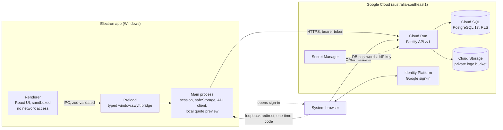
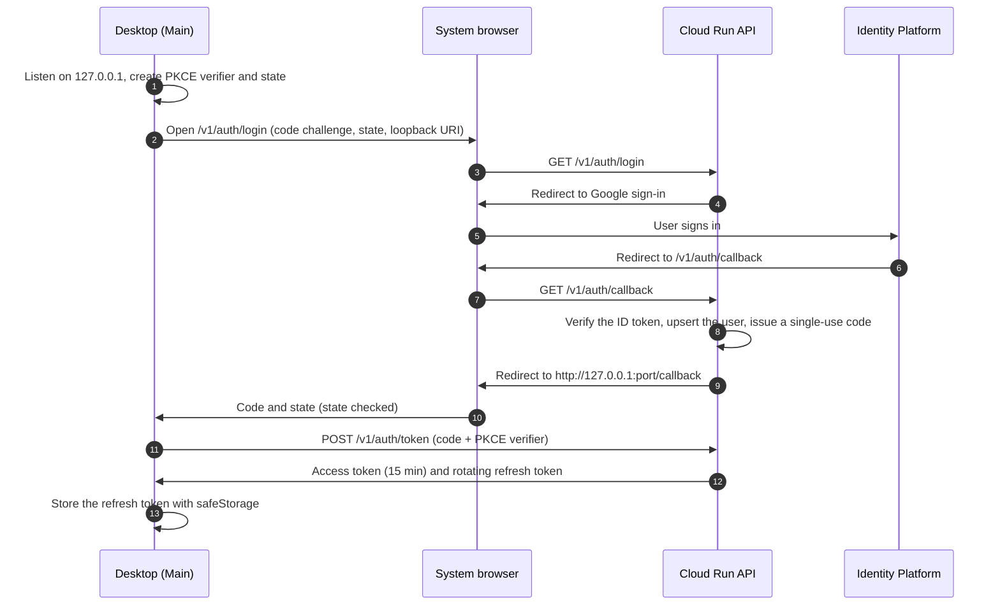
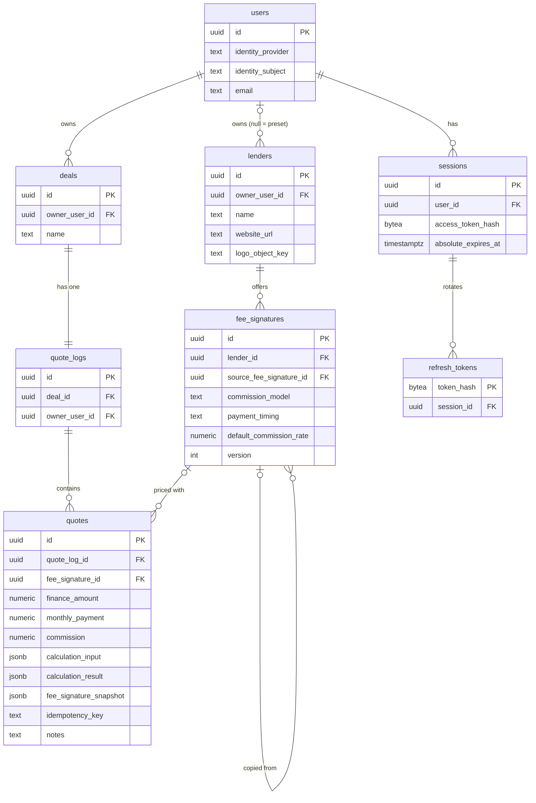

# Swyft Finance: Multi-Lender Quoting Calculator

A desktop quoting tool for finance brokers. Quote a loan with several lenders, keep the quotes on a deal, compare them side by side and copy an email-ready summary for the client.

The app is built with Electron and React. It talks to a small API on Google Cloud Run backed by PostgreSQL (Cloud SQL) with row-level security. Google sign-in runs through Identity Platform in the system browser, and lender logos live in Cloud Storage, reached only through the API.

**Download:** [latest release](https://github.com/maharudraabhishek/swyft-loan-calculator/releases/latest). The installer is for **Windows 10/11 x64** (NSIS, unsigned: on first run choose _More info → Run anyway_).

## Architecture



| Path                 | Role                                                                                                                                                                                                             |
| -------------------- | ---------------------------------------------------------------------------------------------------------------------------------------------------------------------------------------------------------------- |
| `apps/desktop`       | Electron app. Renderer (React UI) → preload bridge (`auth`, `deals`, `quotes`, `lenders`) → Main (session manager, loopback sign-in receiver, `safeStorage`, API client, local quote preview, clipboard export). |
| `apps/api`           | Fastify `/v1` API: identity, deals and lenders modules, migration runner and database CLI. SQL migrations are in `apps/api/db/migrations`.                                                                       |
| `packages/finance`   | Decimal-based calculation engine: four commission models, payment timing, amortisation schedules, daily interest.                                                                                                |
| `packages/quoting`   | Maps a lender fee signature plus the broker's choices onto an engine input (fees, lender-specific fees, caps). Used by both the desktop preview and the API.                                                     |
| `packages/contracts` | Shared zod schemas and DTOs for IPC and HTTP, validated on both sides.                                                                                                                                           |

Design decisions:

- **One stateless API.** It owns all authorization, recalculates every quote before saving and stores an immutable calculation snapshot.
- **Same engine everywhere.** Main uses the shared packages for the instant local preview (which also works offline); the API runs the same code for the saved figures, so figures sent by the client are never trusted.
- **Main owns all network access and secrets.** The renderer's CSP is `connect-src 'none'` and it never sees a token; every HTTP call goes through Main.

## Security

- **Electron:** `contextIsolation: true`, `nodeIntegration: false`, `sandbox: true`. IPC senders and frames are checked, every argument is validated with zod, and navigation, new windows, webviews and permission requests are blocked.
- **Sign-in:** Google sign-in opens in the user's normal browser. The API completes the OAuth flow and returns a single-use code to the app over a loopback redirect protected with PKCE and `state` (flow below).
- **Sessions:** the API issues opaque tokens. Access tokens last 15 minutes and are held in Main's memory only. The rotating refresh token is stored with `safeStorage` (DPAPI on Windows), bound to the API origin and deleted on sign-out. Reusing a refresh token revokes the whole session, and the server stores only token hashes.
- **API:** every non-public route requires a valid session (a test enumerates the route table and checks each route for 401), request bodies use strict schemas, and other users' records return 404.
- **Database:** row-level security on every table. The runtime role owns nothing and cannot bypass RLS; PostgreSQL resolves the user from the request's token hash.
- **Secrets:** database passwords and the Identity Platform key live in Secret Manager and are read only by Cloud Run. The installer contains no secrets; its only configuration is the public API origin.
- **Logos:** uploads go app → API → private bucket (PNG, JPEG or WebP, checked by file signature, up to 512 KB). The app holds no cloud credentials.



## Database

PostgreSQL 17 on Cloud SQL, in three schemas:

- **`app`:** `users`, `deals`, `quote_logs`, `quotes`, `lenders`, `fee_signatures`.
- **`auth`:** `login_attempts`, `sessions`, `refresh_tokens`.
- **`app_meta`:** `schema_migrations`.



- **Deal → Quote Log → Quote.** Each deal has a UUID, a name and exactly one quote log; quotes belong to that log.
- **Owner-carrying foreign keys.** `quote_logs → deals` and `quotes → quote_logs` include `owner_user_id` in the key, so a row can never point at another user's parent.
- **Presets and copies.** Built-in lenders and their 10 fee signatures are shared read-only rows (`owner_user_id` null). A broker's own lenders and signatures are private, and a copied signature keeps a link to its source.
- **Saved quotes are self-contained.** Every quote stores its input, result and a snapshot of the fee signature (with its version), so later edits to a signature never change saved figures. `(owner_user_id, idempotency_key)` is unique, so a retried save cannot duplicate a quote.
- **Migrations.** They are additive and checksummed; applied files are never edited.

## API

JSON over HTTPS. Money and rates travel as decimal strings. Errors use one envelope: `{ "error": { "code", "message", "requestId", "fields"? } }`, where `fields` holds per-field validation messages.

| Method             | Path                        | Purpose                                                                                                        |
| ------------------ | --------------------------- | -------------------------------------------------------------------------------------------------------------- |
| GET                | `/health`, `/ready`         | Liveness; readiness (database reachable)                                                                       |
| GET                | `/v1/auth/login`            | Start Google sign-in (PKCE challenge, `state`, loopback redirect URI)                                          |
| GET                | `/v1/auth/callback`         | Identity Platform callback; redirects to the app's loopback address with a single-use code                     |
| POST               | `/v1/auth/token`            | Exchange the code (with the PKCE verifier) or a refresh token for new tokens                                   |
| POST               | `/v1/auth/logout`           | Revoke the session                                                                                             |
| GET                | `/v1/me`                    | Signed-in user                                                                                                 |
| GET, POST          | `/v1/deals`                 | List or create deals                                                                                           |
| GET, PATCH, DELETE | `/v1/deals/{dealId}`        | Open, rename or delete a deal (deleting removes its quotes)                                                    |
| GET, POST, DELETE  | `/v1/deals/{dealId}/quotes` | List quotes; save a quote (recalculated on the server, requires an `Idempotency-Key` header); clear all quotes |
| GET, PATCH, DELETE | `/v1/quotes/{id}`           | Read a quote, edit its notes, delete it                                                                        |
| GET, POST          | `/v1/lenders`               | Presets plus own lenders; create a lender                                                                      |
| PATCH, DELETE      | `/v1/lenders/{id}`          | Edit or delete an own lender                                                                                   |
| GET, PUT, DELETE   | `/v1/lenders/{id}/logo`     | Download, upload (raw PNG, JPEG or WebP body) or remove a logo                                                 |
| GET, POST          | `/v1/fee-signatures`        | Presets plus own signatures; create one (for example a copy of a preset)                                       |
| GET, PUT, DELETE   | `/v1/fee-signatures/{id}`   | Read, replace (bumps the version) or delete an own signature                                                   |

Every `/v1` route outside `/v1/auth` requires `Authorization: Bearer <access token>`; logout authenticates with the refresh token in its body.

## Deployment (Google Cloud)

| Resource              | Use                                                                                               |
| --------------------- | ------------------------------------------------------------------------------------------------- |
| Cloud Run `swyft-api` | The API (`australia-southeast1`), scales 0–3, dedicated service account                           |
| Cloud Run jobs        | `swyft-db-bootstrap`, `swyft-db-migrate`, `swyft-db-verify` (roles, migrations, RLS verification) |
| Cloud SQL `swyft-db`  | PostgreSQL 17, reached through the Cloud SQL connector                                            |
| Identity Platform     | Google sign-in provider                                                                           |
| Cloud Storage         | Private lender-logo bucket (public access prevention, uniform access)                             |
| Secret Manager        | Database role passwords, Identity Platform API key                                                |
| Artifact Registry     | API container images                                                                              |

A release builds one container image from the `Dockerfile`. The same image runs the three database jobs and the service. The order is: update the jobs, run `swyft-db-migrate`, run `swyft-db-verify` (roles, RLS and cross-user isolation checks), then deploy `swyft-api`, which keeps its environment, secrets and service account. Rollback routes traffic back to the previous Cloud Run revision.

## Prerequisites

Windows, Python 3.10+, Node.js 24, pnpm 11.22.0 (via Corepack) and Docker Desktop (PostgreSQL for development and tests).

## Run locally

```powershell
python scripts/run_local.py dev              # database + API + hot-reloading desktop
python scripts/run_local.py production       # compiled API + desktop, same local services
python scripts/run_local.py cloud            # compiled desktop against the deployed Cloud Run API (real Google sign-in)
```

On first run the launcher installs dependencies (`pnpm install --frozen-lockfile`); `dev` and `production` also start PostgreSQL in Docker. Both use a local development sign-in page (any email) in place of Google, because Google only redirects to the registered Cloud Run callback. `cloud` uses real Google sign-in.

Run one mode at a time. The launcher creates a git-ignored local password file, keeps database data between runs, and stops the app and API when you close the window or press `Ctrl+C`. If the API or renderer port is held by another process from this workspace, it frees the port; otherwise it picks a free one.

## Using the app

1. **Sign in** with Google. Your browser opens; return to the app when it says you are signed in. The session is remembered until you sign out.
2. **Calculator** (the landing screen; no deal needed):
   - Choose a lender and fee signature. The card shows its commission model, timing and fees.
   - Enter the loan details: finance amount, term, asset, balloon, base rate and commission, and fees. Commission-overs lenders take a contract rate instead of a commission; daily-interest lenders also need settlement and first repayment dates.
   - The preview updates as you type and is marked _Not saved_.
   - **Target commission:** enter the dollar amount you want to earn, then _Find contract rate_ (commission-overs lenders) or _Find commission %_ (others), and _Use this rate_.
3. **Deals** hold quotes (Deal → Quote Log → Quote). Open one from the deal list, create one with **New deal**, or, with no deal open, type a **New deal name** in the calculator.
4. **Add quote to log** saves the quote to the open deal, creating the named deal first if needed. The API recalculates it and the saved figures are shown. The loan details stay filled in, so you can switch lender and add more quotes to compare.
5. **Saved quotes:**
   - Tick the repayment frequencies to show (monthly, fortnightly, weekly).
   - Switch figures on or off: base rate, comparison rate, commissions, total hiring. The same switches apply to the email.
   - Open a row for all details and notes, delete a quote, **Clear all quotes**, or switch to **Compare side by side**.
6. **Client email:** tick the quotes to include, check the preview, then **Copy quote to clipboard** and paste into Gmail or Outlook. Turn off _Commissions_ for client-facing emails.
7. **Lenders:**
   - Built-in fee signatures are read-only and show the lender's website; **Duplicate to customise** creates your own editable copy.
   - **Add lender** creates your own lender (name and https website), and **Upload logo** stores a PNG, JPEG or WebP (up to 512 KB) through the API.
   - Deleting a lender also deletes its custom fee signatures; saved quotes keep their figures.
8. **Repayment schedule:** open _Repayment schedule_ under the preview.
   - Daily-interest lenders are dated from their settlement and first repayment dates, with weekends and NSW public holidays moved.
   - Other lenders are dated from the _Settlement date_ you enter (advance: first payment at settlement; arrears: one month later).

## Verify and build

```powershell
pnpm verify                                  # format, lint, typecheck, build, DB + real-stack tests (Docker), unit/fixture tests
pnpm test:db                                 # API + PostgreSQL/RLS integration tests on a disposable database
pnpm test:integration                        # desktop UI + Main code against the real API and PostgreSQL
pnpm test                                    # all package unit tests
pnpm desktop:package:win                     # Windows installer (uses the public API origin in apps/desktop/.env.production)
```

The installer is written to `apps/desktop/dist/`. `pnpm verify` runs every check and fails only on the five official fixture fields listed under _Finance validation_.

Testing approach:

- **Unit:** the engine, including the brief's formulas and worked example line by line (`brief-math-spec.test.ts`).
- **Cross-checks:** SPG's four HTML calculators run unmodified over an input grid (`spg-calculators-grid.test.ts`).
- **Fixtures:** the official test cases and lender schedules.
- **Integration:**
  - API tests against real PostgreSQL with RLS
  - a real-stack suite driving the desktop UI and Main code against the real API
- **Packaged app:** smoke, sign-in and end-to-end workflow scripts in `apps/desktop/scripts`, run against the installed build.

## Finance validation

The engine follows the brief's formulas with full-precision decimals and rounds each payment and commission to the cent only at the end. The evidence is in `packages/finance/tests`:

- **Brief formulas and worked example:** all match. The brief prints the intermediate (1+i)^60 as 1.52699, which is a misprint (the exact value is 1.52730); only full precision reaches its final $650.68.
- **SPG's four HTML calculators, run unmodified:**
  - Traditional and Pepper: every displayed figure is identical.
  - Branded: every payment is identical.
  - Autopay: NAF, commission, principal and first interest are identical.
  - The remaining differences are explained under _Assumptions_.
- **`test-cases.json`:** 3 of 8 cases pass fully, and 41 of 46 fields. The 5 failing fields contradict SPG's own calculators (`fixture-disputes.test.ts`). No fixture was edited.
- **Lender schedules in the brief:**
  - Traditional: the CSV payments do not repay their own loans ($538.15 remains after 60 payments); the engine and SPG's calculator agree.
  - Pepper: within 1–9¢ (the 0.4 loading factor is reverse-engineered).
  - Branded: payments exact; commission within $0.44.
  - Autopay 84-month schedule: every row within $0.01 when settled on the date its first interest implies (the CSV marks its settlement date as approximate).
- **Broker receives (commission + GST):** exact, $2,400.15 and $2,491.50 (Traditional).

The five disputed `test-cases.json` fields:

- **westpac-basic:** $656.19 is the advance payment with the $495 fee counted twice. SPG's calculator gives $646.10, as the engine does.
- **westpac-with-balloon:** $844.22 fits no reading of the inputs. SPG's calculator gives $914.16.
- **Pepper amounts financed:** SPG's calculator gives $35,846.08 and $36,362.53, not $35,845.85 and $36,352.85.
- **Autopay:** SPG's calculator gives first interest $147.11. The expected $147.01 and $495.29 come from a real lender schedule that uses ÷365.25 and whose first payment failed. The brief, `lender-configs.json`, SPG's calculator and the other Autopay schedule all use ÷365.

## Design questions from the brief

- **Floating-point precision.** Money and rates are Decimal.js values in `@swyft/finance`, using a dedicated Decimal clone (40 significant digits, round half-up). They cross IPC, HTTP and PostgreSQL (`numeric`) as decimal strings, never as binary floats, and are rounded only for the final payment, commission and display.
- **Adding a commission model.** `calculateQuote` dispatches on the input's `model` to one calculator per model (capitalised, overs, loaded, daily), with typed inputs and results. `@swyft/quoting` maps a fee signature's `commission_model` and parameters onto that input. A new model needs a new input/result type, a calculator, a mapping case, a schema value and a UI label; payment timing stays a separate setting.
- **Validating inputs before calculation.** The same zod schemas (`@swyft/contracts`) check the quote form in the UI, every IPC argument in Main and every API request (strict objects, no extra fields). Lender rules (commission and origination caps, required dates) come from `@swyft/quoting` as field messages. The engine rejects invalid values as a last line of defence, and the API recalculates before saving.
- **Logo uploads without cloud keys.** The UI asks Main to pick a file. Main opens the OS file dialog, checks the size (up to 512 KB) and the PNG/JPEG/WebP signature bytes, and sends the bytes to the API with the user's session. The API checks ownership, type and size and stores the object in a private Cloud Storage bucket using the Cloud Run service identity. Images come back through the API.
- **Where the engine lives.** In shared, pure TypeScript packages (`@swyft/finance`, `@swyft/quoting`). Main uses them for the instant local preview, and the API uses the same code to recalculate every quote before saving. The sandboxed UI only displays results.
- **Updating a preset lender's fees.** Presets are shared, read-only rows maintained by migrations. A broker uses _Duplicate to customise_ to get their own copy (copy-on-write, linked to its source) and edits that. Every edit bumps the signature version, and saved quotes keep an immutable calculation snapshot, so changing or deleting a signature never alters saved quotes.

## Assumptions

- **Branded commission.**
  - Overs are calculated from standard (arrears) instalments even when repayments are in advance, because the three Branded contracts in the brief state their commissions on that basis.
  - Instalments are rounded to the cent before the hiring difference, as `test-cases.json` requires ($939.51). SPG's HTML calculator uses unrounded instalments, so its commission can differ by up to $0.64.
- **Autopay timing.** The brief's preset table says Advance, but its Autopay test case, CSV schedules and calculator all charge interest on the first repayment. The app models the early start with the first repayment date and shows it as "From 1st repayment date".
- **Autopay payment.** SPG's HTML calculator approximates the payment ($1,777.01 on the lender's own loan). The engine solves it over the actual payment dates and matches the lender's schedules ($1,767.42 and $1,060.74).
- **Daily-interest day count.** Daily interest uses actual/365, as stated in the brief, `lender-configs.json` and SPG's calculator.
- **Frequencies.** Fortnightly and weekly amounts use the exact monthly × 12/26 and × 12/52. The brief's own $300.31 example needs the exact division; its rounded 0.4615 factor would give $300.29.

## Known limitations

- Google sign-in is in Testing mode, so only Google accounts added as test users can sign in.
- "Round up payment to whole dollar" (from the brief's rounding rules) is not implemented. No supplied lender, test case or schedule uses it, so it does not affect any official case. It is planned as an opt-in per-lender setting.
- A custom fee signature keeps the fee types of the signature it was copied from (amounts, financing, commission and timing are editable); adding a new fee type is not supported.
- The amortisation schedule is shown for the live preview; saved quotes keep their calculation snapshot but do not re-render a schedule.
- Display preferences are stored per device, not per account.
- Preset lender logo images are not included; the brief gives only lender websites.
- If the OS offers no secure storage, the session is kept in memory only, and the app says so.
- NSW business-day dates cover 2025–2032.
- Sign-in rate limits are per Cloud Run instance (at most 3); there is no Cloud Armor.
- The installer is Windows-only and unsigned. macOS builds, automatic updates, native menus and remembered window size are not yet implemented.
